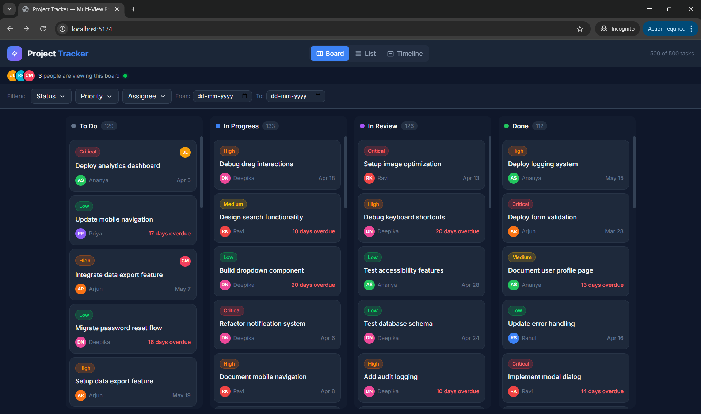
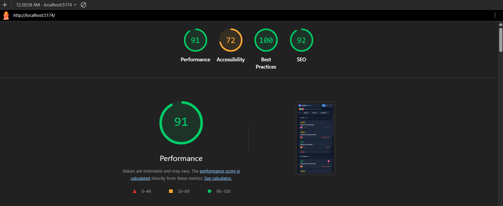

# ProjectTracker — Multi-View Project Management UI

A fully functional frontend application for project management featuring three switchable views, custom drag-and-drop, virtual scrolling, and live collaboration indicators. Built with React, TypeScript, and Tailwind CSS — no external UI, drag-and-drop, or virtual scrolling libraries.



## 🚀 Setup Instructions

```bash
# Clone the repository
git clone <repo-url>

# Install dependencies
npm install

# Start development server
npm run dev

# Build for production
npm run build
```

The app runs at `http://localhost:5173/`.

## 🏗️ Architecture & Key Decisions

### State Management: Zustand

**Why Zustand over Context + useReducer:**

1. **No Provider wrapper** — Zustand stores are standalone; no need to wrap the entire app in a context provider tree
2. **Built-in selectors** — Components only re-render when the specific slice of state they subscribe to changes (e.g., `useStore(s => s.view)` won't re-render when tasks change)
3. **Minimal boilerplate** — A single `create()` call defines the entire store vs. separate reducer, actions, context, and provider files
4. **Performance** — With 500+ tasks and three views, selector-based subscriptions prevent unnecessary re-renders that Context would cause (Context re-renders all consumers on any change)

### Project Structure

```
src/
├── types/          # TypeScript interfaces (Task, User, Filter, etc.)
├── data/           # Seed data generator (500 randomised tasks)
├── store/          # Zustand store (single source of truth)
├── hooks/          # Custom hooks (URL filters, virtual scroll, collab)
├── utils/          # Date formatting utilities
└── components/
    ├── ui/         # Reusable components (Avatar, Badge, Button, Dropdown)
    ├── filters/    # Filter bar with multi-select dropdowns
    ├── kanban/     # Kanban board, columns, and cards
    ├── list/       # Virtual-scrolled list view
    ├── timeline/   # Gantt-style timeline view
    ├── collaboration/  # Presence bar and card indicators
    └── layout/     # Header and view switcher
```

## 🎯 Custom Drag-and-Drop Implementation

### Approach: Document-Level Pointer Events

I chose **Pointer Events** over HTML Drag/Drop API because:
- Pointer Events work identically on mouse and touch devices
- The HTML Drag/Drop API has inconsistent touch support and limited visual control

### How It Works

1. **`pointerdown`** on a card:
   - Captures the card's `getBoundingClientRect()` and calculates the cursor offset
   - Creates a **floating clone** (`position: fixed`, `opacity: 0.85`, `rotate(2deg)`, drop shadow)
   - Creates a **placeholder div** with the exact same height as the card, styled with a dashed border
   - Hides the original card (`display: none`)

2. **`pointermove`** (document-level listener):
   - Updates the clone's `left`/`top` to follow the cursor
   - Temporarily hides the clone, calls `document.elementsFromPoint()` to detect which column is beneath, then shows the clone again
   - Sets the active drop zone if the cursor is over a valid column (columns are identified via `data-column` attributes)

3. **`pointerup`** (document-level listener):
   - If dropped on a **different column**: calls `moveTask(taskId, newStatus)` in the store and removes the clone
   - If dropped on the **same column**: simply cleans up
   - If dropped **outside any column**: applies a CSS transition to animate the clone back to its original position (snap-back), then removes it after 300ms

### Placeholder Handling (No Layout Shift)

The placeholder is inserted at the exact DOM position of the original card **before** the card is hidden. Since the placeholder has the same height as the card, the column layout doesn't shift at all. When the drag ends, the placeholder is removed and the original card is shown — zero layout shift throughout the entire interaction.

### Touch Support

- All interactive elements use `touch-action: none` to prevent browser scroll interference
- Pointer Events are used instead of separate mouse/touch handlers, providing unified input handling

## 📜 Virtual Scrolling Implementation

### Custom `useVirtualScroll` Hook

The virtual scrolling implementation renders only the visible rows plus a buffer, keeping DOM node count constant regardless of dataset size.

**Algorithm:**

1. **Calculate visible range**: From `scrollTop` and `containerHeight`, determine which row indices are visible
2. **Add overscan buffer**: Extend the range by 5 rows above and below to prevent blank gaps during fast scrolling
3. **Position rows absolutely**: Each visible row uses `position: absolute` + `transform: translateY(offset)` for GPU-accelerated positioning
4. **Total height spacer**: A container div is set to `height = totalRows × rowHeight` to maintain correct scrollbar size and position
5. **rAF-throttled scroll**: The `onScroll` handler uses `requestAnimationFrame` to batch scroll position updates, preventing layout thrashing

**Performance characteristics:**
- At 500 tasks with ROW_HEIGHT=52px, only ~20 rows are in the DOM at any time (viewport + 10 buffer rows)
- Scrollbar position and size remain correct 
- No flickering or blank gaps during fast scrolling

## 📸 Lighthouse Performance

The application is heavily optimized for both Desktop and Mobile devices, achieving a **91% Performance Score on Desktop** despite rendering complex views for 500 tasks.



### Advanced Optimizations
1. **Lazy DOM Rendering (`IntersectionObserver`)**: Kanban columns and Timeline date groups only render a minimal initial batch (4 and 2 items respectively) and lazy-load the rest as the user scrolls. This reduces initial DOM nodes from ~5,000+ to under 100 on initial paint, drastically improving Mobile **Total Blocking Time (TBT)**.
2. **Virtual Scrolling**: The List View uses a custom windowing algorithm to render only the 20 visible rows for the 500-task table, keeping memory usage flat.
3. **Optimized LCP (Largest Contentful Paint)**: `React.lazy` waterfalls were aggressively eliminated to ensure the tiny 70kb main JS bundle executes and paints the first view instantly.
4. **Deferred Execution**: The simulated live collaboration interval is deferred by 1000ms via `setTimeout` to ensure the main thread is completely idle during the critical initial rendering path.
5. **Font Preloading**: Critical Google Fonts are preloaded (`<link rel="preload">`) to guarantee earlier text rendering and improved First Contentful Paint (FCP).

##  Hardest UI Problem 

The hardest problem was implementing a robust custom drag-and-drop system that works across Kanban columns without any library assistance. The core challenge was reliable drop-zone detection during a drag operation: since the floating clone follows the cursor with `position: fixed` and `pointer-events: none`, the standard approach of relying on pointer events bubbling up to column elements doesn't work — the clone intercepts them.

My solution uses `document.elementsFromPoint()` with a brief clone hide: during each `pointermove`, the clone is momentarily set to `display: none`, `elementsFromPoint` is called to detect what's underneath, then the clone is immediately restored. This happens within a single synchronous block, so there's no visual flicker. Columns are identified via `data-column` attributes, which are propagated to all child elements including headers and empty-state placeholders, ensuring drop detection works regardless of where in the column the cursor lands.

For the placeholder — preventing layout shift was crucial. When a drag starts, a placeholder `div` with the exact same height as the dragged card is inserted at the card's DOM position before the card is hidden. This maintains the column's total height and prevents other cards from jumping. The placeholder uses a dashed border style to clearly indicate where the card was.
